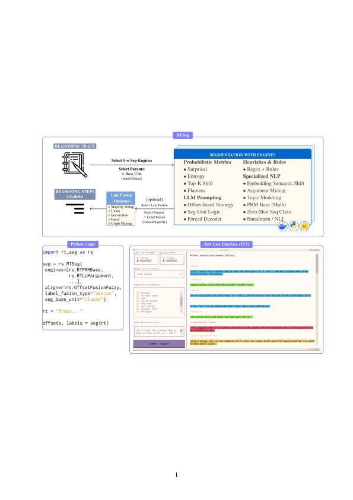

# Core Concepts

<p align="center">
  
</p>

## What `RTSeg` Returns

`RTSeg(trace)` produces:

* `offsets`: `list[tuple[int, int]]` — character offsets into the trace
* `labels`: `list[str]` — one label per segment

You can reconstruct segments via:

```python
segments = [trace[s:e] for (s, e) in offsets]
```

---

## Segmentation Base Unit (`seg_base_unit`)

Most engines operate on a base segmentation first:

* `"clause"` (default) → finer granularity
* `"sent"` → coarser segmentation

## Quickstart — Single Engine

```python
from rt_seg import RTSeg
from rt_seg import RTRuleRegex

trace = "First step... Then second step... Finally conclude."

segmentor = RTSeg(
    engines=RTRuleRegex,
    seg_base_unit="clause",
)

offsets, labels = segmentor(trace)

for (s, e), label in zip(offsets, labels):
    print(label, "=>", trace[s:e])
```

## Multiple Engines + Late Fusion

If you pass multiple engines, you must provide an **aligner**.

```python
from rt_seg import RTSeg
from rt_seg import RTRuleRegex
from rt_seg import RTBERTopicSegmentation
from rt_seg import OffsetFusionGraph

segmentor = RTSeg(
    engines=[RTRuleRegex, RTBERTopicSegmentation],
    aligner=OffsetFusionGraph,
    label_fusion_type="concat",  # or "majority"
    seg_base_unit="clause",
)
trace = "..."
offsets, labels = segmentor(trace)
```

### Label Fusion Modes

* `"majority"` — choose most frequent label
* `"concat"` — concatenate labels (useful for debugging)
